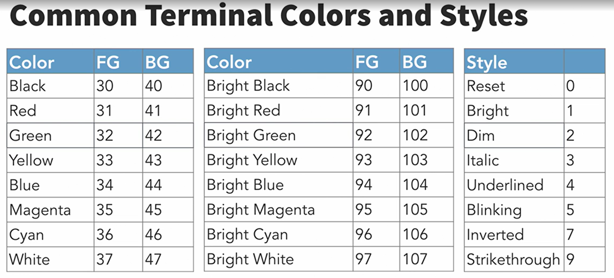
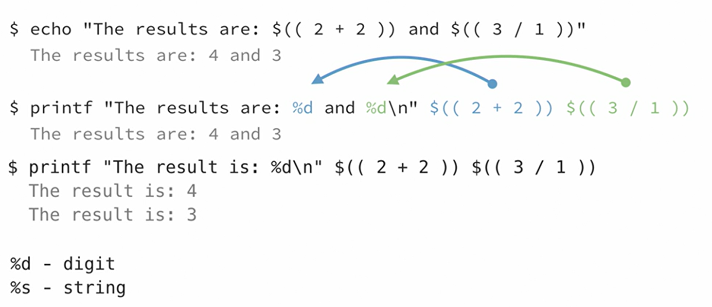

# Understanding Bash script syntax
- One-liners: can be very long, runon list of commands usually piped
- bash script: text file with all the commands written out
  - the shebang makes it executable 
  - #!/bin/bash

# Comparing values with test
- use [..] to test expressions to verify true or false, ie. test if a file exists, has content, or are equal, etc.
- ```["cat" = "dog"]; echo $?``` does not equal 0 so false
- ```["cat" = "cat"]; echo $?``` equals 1 so true
### Extended test uses [[...]] double brackets
 enables output based on true/false statements and includes AND/OR statements
 
 # Formatting and styling text output
 - ```echo -e "Name\t\tNumber"; echo -e "Brandon\t\t123"```
 - ```echo -e "This text/nbreaks over\nthree lines"```
 - ```echo -e "\a"``` is a bell function that depending on what interface is used creates an audio or visual notification
 ### Changing terminal colors and styles
 - ```echo -e "\033[33;44mColor Text\033[0m"```
 

# Formatting output with printf

